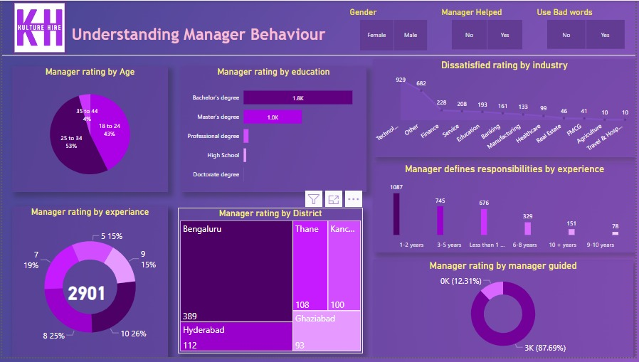

# Understanding the managers in india

### Who are affected :
My brother and his team members are greatly affected by the actions of their manager. The manager puts immense pressure on them by assigning an excessive number of tasks and imposing strict deadlines within the sprint. Additionally, the manager schedules late-night calls, which not only disturbs their mental health but also impairs their personal lives.

### What is happening:
The manager is driven by the desire to meet internal deadlines and gain recognition from the client. However, the manager seems to prioritize personal recognition over the well-being and circumstances of the employees. This results in an environment where employees face constant pressure and are expected to deliver without any consideration for their situation.

### When is happening:
This situation tends to occur whenever there are new changes or enhancement requests from the client. The manager responds by applying even more pressure on my brother and his team, disregarding the potential impact on their workload and overall well-being.

### Where is happening:
This problem is prevalent in my brother's work environment at Chennai, and it is not an isolated incident. Many corporate and multinational companies exhibit similar behavior, where employees are unable to voice their concerns and are compelled to prioritize work over their own needs and family obligations.

### why is that a problem :
The self-serving approach of managers not only undermines employee well-being but also impacts productivity and overall organizational success. When employees are constantly overworked and under immense pressure, their creativity, motivation, and job satisfaction suffer. This can lead to a decrease in quality of work, increased absenteeism, and higher employee turnover rates. Additionally, the lack of recognition for team contributions hampers employee morale and engenders a culture of disengagement.

### Objectives:
To address this problem, organizations need to prioritize employee well-being and create a healthy work environment. Managers should be trained in effective leadership, empathy, and the importance of work-life balance. Recognizing and appreciating the efforts of employees can foster a positive culture where individuals feel valued and motivated to perform at their best.

In conclusion, the detrimental impact of managers in India extends beyond my brother's experience. It affects employees nationwide, leading to increased stress levels, compromised well-being, and reduced productivity. By acknowledging and rectifying these issues, organizations can cultivate an environment that nurtures employee growth, engagement, and overall success.

# OUTPUTS

## PowerBI

<h1> </h1>
